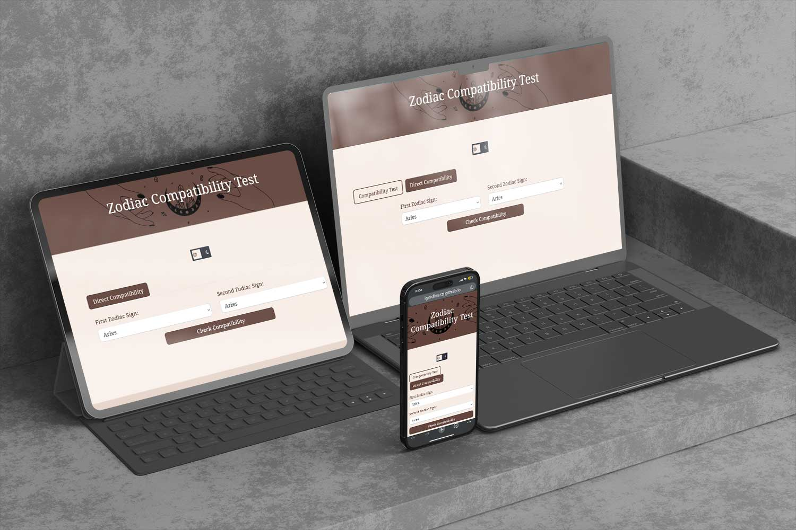
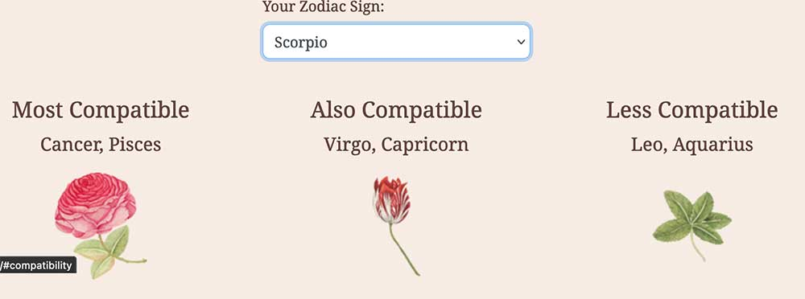
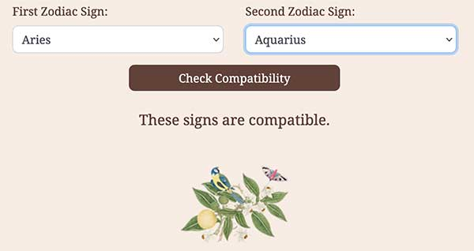
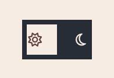
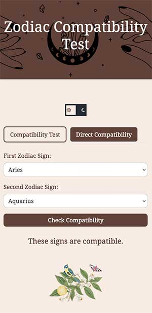
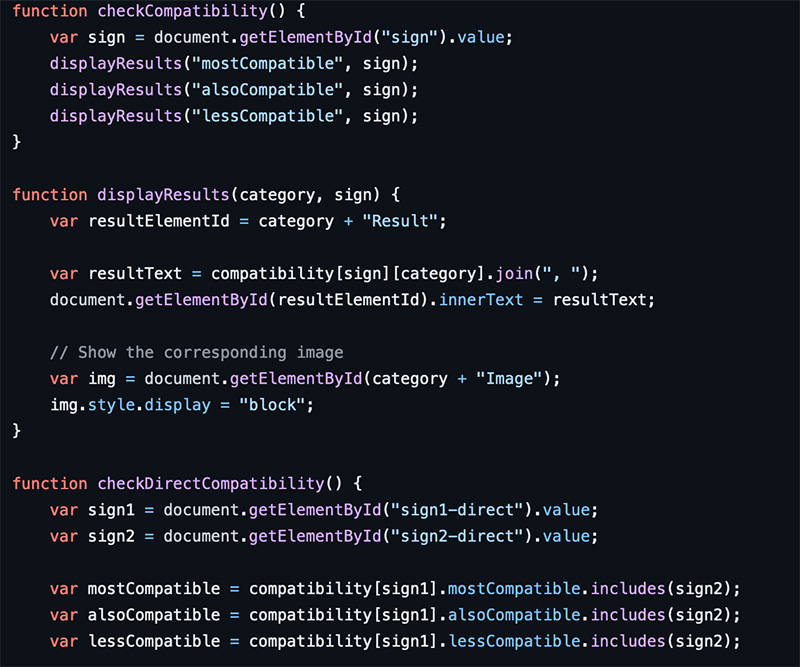
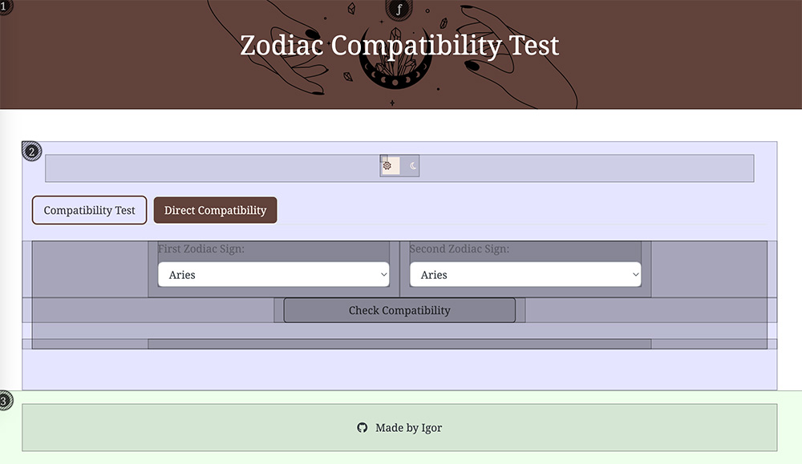
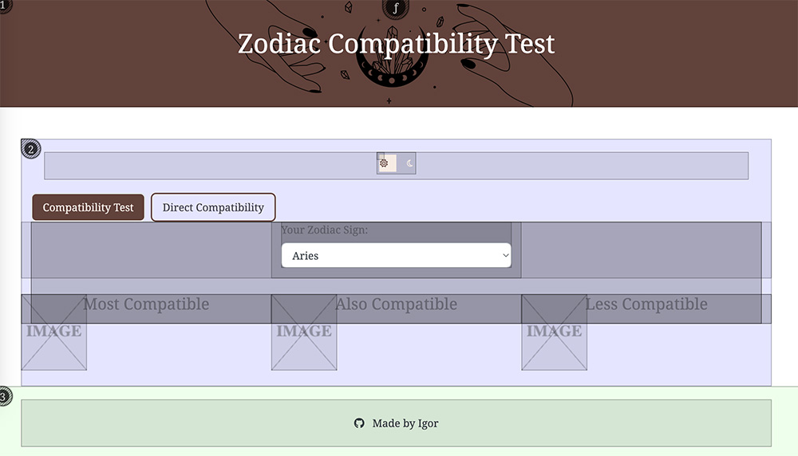
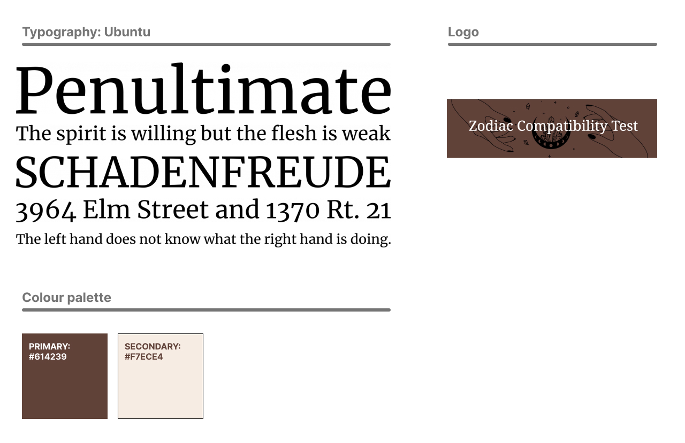

# Zodiac Compatibility Test Project

## Table of Contents
- [Introduction](#introduction)
- [Features](#features)
- [Main Components](#main-components)
- [Key Functions](#key-functions)
- [Technologies Used](#technologies-used)
- [Setup and Installation](#setup-and-installation)
- [Usage](#usage)
- [Compatibility Logic](#compatibility-logic)
- [Learning Outcomes](#learning-outcomes)
- [User Stories](#user-stories)
- [Design Elements](#design-elements)
- [User Flow](#user-flow)
- [Task Flow](#task-flow)
- [Usability Testing](#usability-testing)
- [Deployment](#deployment)
- [Contributing](#contributing)
- [License](#license)
- [Acknowledgments](#acknowledgments)
- [Contact](#contact)

## Introduction
Welcome to the "Zodiac Compatibility Test" project! This interactive web application lets users check their zodiac compatibility with others in a fun and engaging way.

## Features
- **Compatibility Test**: Users can select their zodiac sign to find out which signs they are most and least compatible with.

- **Direct Compatibility Check**: Allows users to select two zodiac signs and directly check their compatibility.

- **Theme Switch**: A light and dark mode toggle for user convenience.

- **Responsive Design**: The application is built using Bootstrap, ensuring a responsive layout on various devices.

## Main Components
1. **Event Listeners**: Sets up event listeners that trigger functions for user actions.
2. **Compatibility Logic**: Determines zodiac compatibility using a predefined object.
3. **Dynamic Content Update**: Dynamically updates the webpage content based on user interactions.

## Key Functions

1. **`checkCompatibility()`**: Retrieves user's selected sign and updates compatibility results.
2. **`displayResults(category, sign)`**: Helper function to update text and images for compatibility results.
3. **`checkDirectCompatibility()`**: Checks the compatibility between two selected zodiac signs.
4. **Theme Toggle**: Changes the webpage's theme based on user preference.

## Technologies Used
- HTML5
- CSS3 (with Bootstrap 4.3.1)
- JavaScript
- FontAwesome for icons

## Setup and Installation
To get started with this project:
1. Clone the repository.
2. Open `index.html` in a web browser.
3. No additional installation required.

## Usage
- Use "Compatibility Test" tab to see compatibility results.
- Use "Direct Compatibility" tab for direct sign comparison.
- Toggle between light and dark mode.

## Compatibility Logic
Defined in `compatibility.js`, categorizes zodiac signs into compatible groups.

## Learning Outcomes
As a student, this project was a valuable learning experience in web development. I gained hands-on experience with HTML, CSS, JavaScript, and responsive design. The project improved my understanding of user experience, interactive design, and dynamic content creation. I also learned about the importance of clean, maintainable code and the use of version control systems like Git.

## User Stories
1. **Astrology Enthusiast**: Wants an easy way to check compatibility with friends and potential partners based on zodiac signs.
2. **Casual Browser**: Looks for an entertaining and visually appealing way to explore zodiac compatibility.
3. **UX Designer**: Interested in the design and functionality of web applications focused on user interaction.

## Design Elements

- **Color Scheme**: Reflects zodiac themes with starry and celestial aesthetics.
- **Typography**: Easy-to-read, elegant font to ensure a pleasant user experience.
- **Interactive Elements**: Zodiac selection wheel and dynamic result display.

## User Flow
1. User lands on the homepage.
2. User selects their zodiac sign or two signs for direct comparison.
3. User views compatibility results and engages with the content.
4. User toggles between light and dark mode as per preference.

## Task Flow
1. **Checking Compatibility**:
   - Select a zodiac sign.
   - View the compatibility results.
2. **Direct Compatibility Check**:
   - Select two zodiac signs.
   - View direct compatibility results.
3. **Theme Toggle**:
   - Click the toggle switch.
   - View the theme change instantly.

## Usability Testing
Five users participated in testing the application. They found the interface intuitive and engaging. Suggestions included adding more detailed descriptions for each zodiac sign and improving the mobile responsiveness of the zodiac selection wheel.

## Deployment
The project was deployed on GitHub Pages:
1. Pushed the complete project to a GitHub repository.
2. Navigated to the repository settings and enabled GitHub Pages for the main branch.
3. Accessed the deployed site via the provided GitHub Pages URL.

## Contributing
Contributions are welcome. Feel free to fork the repo and submit pull requests.

## License
Open-source under the [MIT License](LICENSE.md).

## Acknowledgments
- Bootstrap for the responsive framework.
- FontAwesome for the icons used in the theme switch.

## Contact
Created by [Igor](https://github.com/igordinuzzi) - feel free to contact me!
